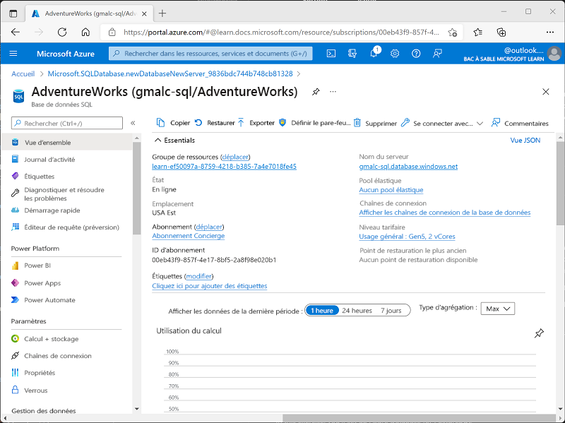
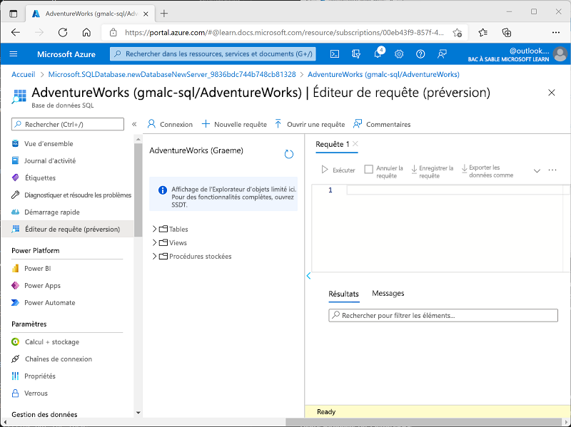
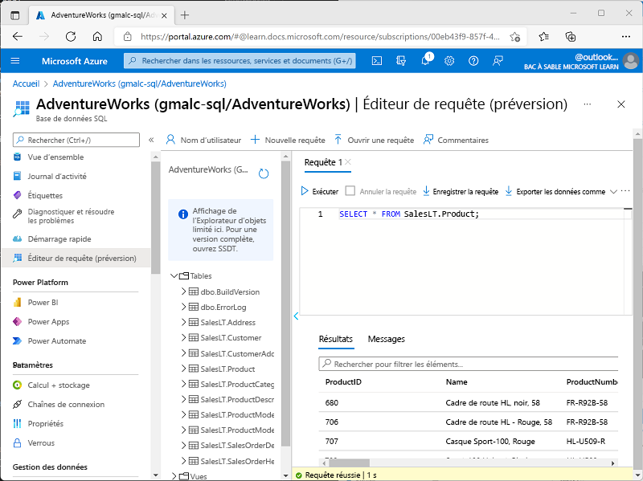

---
lab:
  title: Explorer Azure SQL Database
  module: Explore relational data in Azure
---

# <a name="explore-azure-sql-database"></a>Explorer Azure SQL Database

Dans cet exercice, vous allez provisionner une ressource Azure SQL Database dans votre abonnement Azure, puis utiliser SQL pour interroger les tables d’une base de données relationnelle.

Ce labo prend environ **15** minutes.

## <a name="before-you-start"></a>Avant de commencer

Vous avez besoin d’un [abonnement Azure](https://azure.microsoft.com/free) dans lequel vous avez un accès administratif.

## <a name="provision-an-azure-sql-database-resource"></a>Provisionner une ressource Azure SQL Database

1. In the <bpt id="p1">[</bpt>Azure portal<ept id="p1">](https://portal.azure.com?azure-portal=true)</ept>, select <bpt id="p2">**</bpt>&amp;#65291; Create a resource<ept id="p2">**</ept> from the upper left-hand corner and search for <bpt id="p3">*</bpt>Azure SQL<ept id="p3">*</ept>. Then in the resulting <bpt id="p1">**</bpt>Azure SQL<ept id="p1">**</ept> page, select <bpt id="p2">**</bpt>Create<ept id="p2">**</ept>.

1. Passez en revue les options Azure SQL qui sont disponibles, puis dans la vignette **Bases de données SQL**, assurez-vous que **Base de données unique** est sélectionné, puis sélectionnez **Créer**.

    

1. Dans la page **Créer une base de données SQL**, entrez les valeurs suivantes :
    - **Abonnement**: Sélectionnez votre abonnement Azure.
    - **Groupe de ressources** : Créez un nouveau groupe de ressources en lui attribuant le nom de votre choix.
    - **Nom de la base de données** : *AdventureWorks*
    - <bpt id="p1">**</bpt>Server<ept id="p1">**</ept>:  Select <bpt id="p2">**</bpt>Create new<ept id="p2">**</ept> and create a new server with a unique name in any available location. Use <bpt id="p1">**</bpt>SQL authentication<ept id="p1">**</ept> and specify your name as the server admin login and a suitably complex password (remember the password - you'll need it later!)
    - **Vous souhaitez utiliser un pool élastique SQL ?**  : *Non*
    - **Calcul + stockage** : Laisser tel quel
    - **Redondance du stockage de sauvegarde** : Sélectionner *Stockage de sauvegarde localement redondant*

1. On the <bpt id="p1">**</bpt>Create SQL Database<ept id="p1">**</ept> page, select <bpt id="p2">**</bpt>Next :Networking &gt;<ept id="p2">**</ept>, and on the <bpt id="p3">**</bpt>Networking<ept id="p3">**</ept> page, in the <bpt id="p4">**</bpt>Network connectivity<ept id="p4">**</ept> section, select <bpt id="p5">**</bpt>Public endpoint<ept id="p5">**</ept>. Then select <bpt id="p1">**</bpt>Yes<ept id="p1">**</ept> for both options in the <bpt id="p2">**</bpt>Firewall rules<ept id="p2">**</ept> section to allow access to your database server from Azure services and your current client IP address.

1. Sélectionnez **Suivant : Sécurité >** et définissez l’option **Activer Microsoft Defender pour SQL** sur **Pas maintenant**.

1. Sélectionnez **Suivant : Paramètres supplémentaires >** et, sous l’onglet **Paramètres supplémentaires**, définissez l’option **Utiliser les données existantes** sur **Exemple** (cela crée un exemple de base de données que vous pourrez explorer plus tard).

1. Sélectionnez **Vérifier + créer**, puis **Créer** pour créer votre base de données Azure SQL.

1. Wait for deployment to complete. Then go to the resource that was deployed, which should look like this:

    

1. Dans le volet situé à gauche de la page, sélectionnez **Éditeur de requête (préversion)**, puis connectez-vous avec le nom de connexion administrateur et le mot de passe que vous avez spécifiés pour votre serveur.
    
    *Si un message d’erreur indiquant que l’adresse IP cliente n’est pas autorisée s’affiche, sélectionnez le lien **Liste d’adresses IP autorisées...** à la fin du message pour autoriser l’accès et réessayez de vous connecter (vous avez ajouté précédemment l’adresse IP cliente de votre propre ordinateur aux règles du pare-feu, mais l’éditeur de requête peut se connecter à partir d’une autre adresse en fonction de votre configuration réseau.)*
    
    L’éditeur de requête ressemble à ceci :
    
    

1. Développez le dossier **Tables** pour voir les tables dans la base de données.

1. Dans le volet **Requête 1**, entrez le code SQL suivant :

    ```sql
    SELECT * FROM SalesLT.Product;
    ```

1. Sélectionnez **&#9655; Exécuter** au-dessus de la requête pour l’exécuter et afficher les résultats, lesquels doivent inclure toutes les colonnes de toutes les lignes de la table **SalesLT.Product**, comme illustré ici :

    

1. Remplacez l’instruction SELECT par le code suivant, puis sélectionnez **&#9655; Exécuter** pour exécuter la nouvelle requête et voir les résultats (qui incluent uniquement les colonnes **ProductID**, **Name**, **ListPrice** et **ProductCategoryID**) :

    ```sql
    SELECT ProductID, Name, ListPrice, ProductCategoryID
    FROM SalesLT.Product;
    ```

1. À présent, essayez la requête suivante, qui utilise une instruction JOIN pour obtenir le nom de la catégorie de la table **SalesLT.ProductCategory** :

    ```sql
    SELECT p.ProductID, p.Name AS ProductName,
            c.Name AS Category, p.ListPrice
    FROM SalesLT.Product AS p
    JOIN [SalesLT].[ProductCategory] AS c
        ON p.ProductCategoryID = c.ProductCategoryID;
    ```

1. Fermez le volet de l’éditeur de requête, en ignorant vos modifications.

> **Conseil** : Si vous avez fini d’explorer Azure SQL Database, vous pouvez supprimer le groupe de ressources que vous avez créé dans cet exercice.
