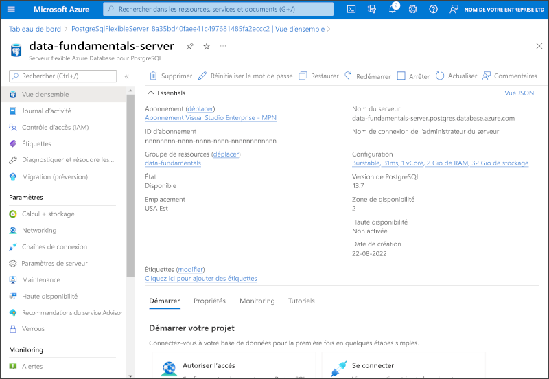

---
lab:
  title: Explorer Azure Database pour PostgreSQL
  module: Explore relational data in Azure
---

# Explorer Azure Database pour PostgreSQL

Dans cet exercice, vous allez provisionner une ressource Azure Database pour PostgreSQL dans votre abonnement Azure.

Ce labo prend environ **5** minutes.

## Avant de commencer

Vous avez besoin d’un [abonnement Azure](https://azure.microsoft.com/free) dans lequel vous avez un accès administratif.

## Provisionner une ressource Azure Database pour PostgreSQL

Dans cet exercice, vous allez provisionner une ressource Azure Database pour PostgreSQL.

1. Dans le portail Azure, sélectionnez **&#65291; Créer une ressource** en haut à gauche et recherchez *Azure Database pour PostgreSQL*. Dans la page **Azure Database pour PostgreSQL** qui apparaît, sélectionnez **Créer**.

1. Examinez les options Azure Database pour PostgreSQL qui sont disponibles, puis dans la vignette **Serveur flexible**, sélectionnez **Créer**.

    

1. Dans la page **Créer une base de données SQL**, entrez les valeurs suivantes :
    - **Abonnement**: Sélectionnez votre abonnement Azure.
    - **Groupe de ressources** : Créez un nouveau groupe de ressources en lui attribuant le nom de votre choix.
    - **Nom du serveur** : Entrez un nom unique.
    - **Région** : Sélectionnez une région proche de votre emplacement.
    - **Version PostgreSQL** : Laissez tel quel.
    - **Type de charge de travail** : Sélectionnez **Développement**.
    - **Calcul + stockage** : Laissez tel quel.
    - **Zone de disponibilité** : Laissez tel quel.
    - **Activer la haute disponibilité** : Laissez tel quel.
    - **Nom d’utilisateur administrateur** : Votre nom.
    - **Mot de passe** et **Confirmer le mot de passe** : Mot de passe respectant les exigences de complexité.

1. Sélectionnez **Suivant : Réseau**.

1. Sous **Règles de pare-feu**, sélectionnez **&#65291; Ajouter l’adresse IP actuelle du client**.

1. Sélectionnez **Vérifier + créer**, puis **Créer** pour créer votre base de données Azure PostgreSQL.

1. Attendez la fin du déploiement. Accédez ensuite à la ressource qui a été déployée, qui doit se présenter comme suit :

    

1. Passez en revue les options pour gérer votre ressource Azure Database pour PostgreSQL.

> **Conseil** : Si vous avez fini d’explorer Azure Database pour PostgreSQL, vous pouvez supprimer le groupe de ressources que vous avez créé dans cet exercice.
