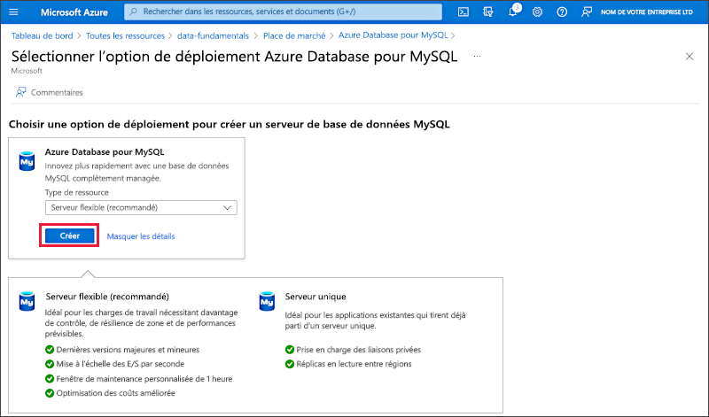
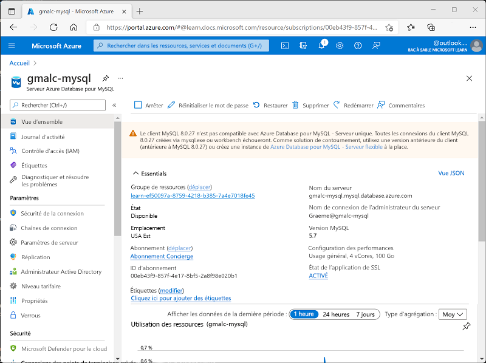

---
lab:
  title: Explorer Azure Database pour MySQL
  module: Explore relational data in Azure
---

# Explorer Azure Database pour MySQL

Dans cet exercice, vous allez provisionner une ressource Azure Database pour MySQL dans votre abonnement Azure.

Ce labo prend environ **5** minutes.

## Avant de commencer

Vous avez besoin d’un [abonnement Azure](https://azure.microsoft.com/free) dans lequel vous avez un accès administratif.

## Provisionner une ressource Azure Database pour MySQL

Dans cet exercice, vous allez provisionner une ressource Azure Database pour MySQL.

1. In the Azure portal, select <bpt id="p1">**</bpt>&amp;#65291; Create a resource<ept id="p1">**</ept> from the upper left-hand corner and search for <bpt id="p2">*</bpt>Azure Database for MySQL<ept id="p2">*</ept>. Then in the resulting <bpt id="p1">**</bpt>Azure Database for MySQL<ept id="p1">**</ept> page, select <bpt id="p2">**</bpt>Create<ept id="p2">**</ept>.

1. Passez en revue les options Azure Database pour MySQL qui sont disponibles, laissez **Type de ressource** tel quel, puis sélectionnez **Créer**.

    

1. Dans la page **Créer une base de données SQL**, entrez les valeurs suivantes :
    - **Abonnement**: Sélectionnez votre abonnement Azure.
    - **Groupe de ressources** : Créez un nouveau groupe de ressources en lui attribuant le nom de votre choix.
    - **Nom du serveur** : Entrez un nom unique.
    - **Région** : Sélectionnez une région proche de votre emplacement.
    - **Version MySQL**  : Laissez tel quel.
    - **Type de charge de travail** : Pour les projets de développement ou de loisirs.
    - **Calcul + stockage** : Laissez tel quel.
    - **Zone de disponibilité** : Laissez tel quel.
    - **Activer la haute disponibilité** : Laissez tel quel.
    - **Nom d’utilisateur administrateur** : Votre nom
    - **Mot de passe** et **Confirmer le mot de passe** : Mot de passe complexe comme il se doit

1. Sélectionnez **Suivant : Réseau**.

1. Sous **Règles de pare-feu**, sélectionnez **&#65291; Ajouter l’adresse IP actuelle du client**.

1. Sélectionnez **Vérifier + créer**, puis **Créer** pour créer votre base de données Azure MySQL.

1. Wait for deployment to complete. Then go to the resource that was deployed, which should look like this:

    

1. Passez en revue les options pour gérer votre ressource Azure Database pour MySQL.

> **Conseil** : Si vous avez fini d’explorer Azure Database pour MySQL, vous pouvez supprimer le groupe de ressources que vous avez créé dans cet exercice.
