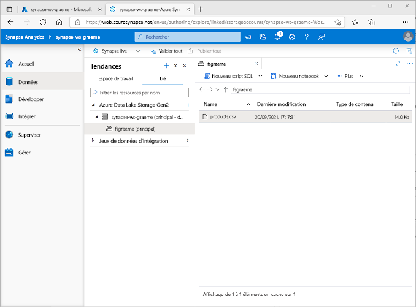
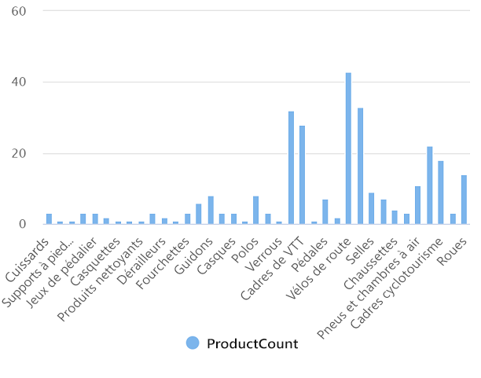
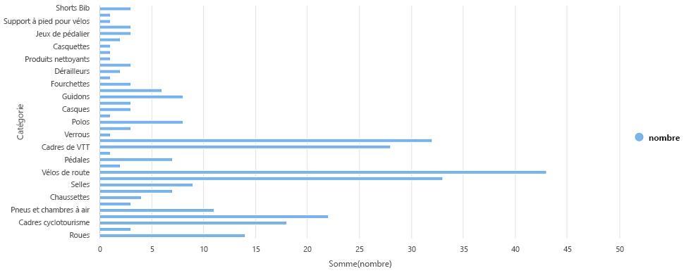

---
lab:
  title: Explorer l’analytique de données dans Azure avec Azure Synapse Analytics
  module: Explore fundamentals of large-scale data warehousing
---

# Explorer l’analytique de données dans Azure avec Azure Synapse Analytics

Dans cet exercice, vous allez provisionner un espace de travail Azure Synapse Analytics dans votre abonnement Azure et l’utiliser pour ingérer et interroger des données.

Ce labo prend environ **30** minutes.

## Avant de commencer

Vous avez besoin d’un [abonnement Azure](https://azure.microsoft.com/free) dans lequel vous avez un accès administratif.

## Provisionner un espace de travail Azure Synapse Analytics

Pour utiliser Azure Synapse Analytics, vous devez provisionner une ressource d’espace de travail Azure Synapse Analytics dans votre abonnement Azure.

1. Ouvrez le portail Azure à l’adresse [https://portal.azure.com](https://portal.azure.com?azure-portal=true) et connectez-vous avec les informations d'identification associées à votre abonnement Azure.

    > **Conseil** : Veillez à travailler dans le répertoire contenant votre abonnement, indiqué en haut à droite sous votre ID d’utilisateur. Si ce n’est pas le cas, sélectionnez l’icône de l’utilisateur et changez d’annuaire.

2. Dans le portail Azure, sur la **page d'accueil**, utilisez l’icône **&#65291; Créer une ressource** pour créer une ressource.
3. Recherchez *Azure Synapse Analytics* et créez une ressource **Azure Synapse Analytics** avec les paramètres suivants :
    - **Abonnement** : *votre abonnement Azure*
        - **Groupe de ressources** : *Créez un groupe de ressources avec un nom approprié, comme « synapse-rg »*
        - **Groupe de ressources géré** : *Entrez un nom approprié, par exemple « synapse-Managed-rg »*.
    - **Nom de l’espace de travail** : *entrez un nom d’espace de travail unique, par exemple « synapse-ws-<votre_nom> »* .
    - **Région** : *Sélectionnez l’une des régions suivantes* :
        - Australie Est
        - USA Centre
        - USA Est 2
        - Europe Nord
        - États-Unis - partie centrale méridionale
        - Asie Sud-Est
        - Sud du Royaume-Uni
        - Europe Ouest
        - USA Ouest
        - USA Ouest 2
    - **Sélectionner Data Lake Storage Gen 2** : À partir de l’abonnement
        - **Nom du compte** : *Créez un nouveau compte avec un nom unique, par exemple « datalake<votre_nom> »*.
        - **Nom du système de fichiers** : *Créez un nouveau système de fichiers avec un nom unique, par exemple « fs<votre_nom> »*.

    > **Remarque** : Un espace de travail Synapse Analytics nécessite deux groupes de ressources dans votre abonnement Azure, à savoir un pour les ressources que vous créez explicitement et un autre pour les ressources managées utilisées par le service. Il nécessite également un compte de stockage Data Lake dans lequel stocker des données, des scripts et d’autres artefacts.

4. Une fois ces détails entrés, sélectionnez **Vérifier + créer**, puis **Créer** pour créer l’espace de travail.
5. Patientez pendant la création de l’espace de travail. Cette opération peut prendre environ cinq minutes.
6. Une fois le déploiement terminé, accédez au groupe de ressources créé et notez qu’il contient votre espace de travail Synapse Analytics et un compte de stockage Data Lake.
7. Sélectionnez votre espace de travail Synapse et, dans sa page **Vue d’ensemble**, dans la carte **Ouvrir Synapse Studio**, sélectionnez **Ouvrir** pour ouvrir Synapse Studio dans un nouvel onglet de navigateur. Synapse Studio est une interface web que vous pouvez utiliser pour travailler avec votre espace de travail Synapse Analytics.
8. Sur le côté gauche de Synapse Studio, utilisez l'icône **&rsaquo;&rsaquo;** pour développer le menu. Cela révèle les différentes pages de Synapse Studio que vous allez utiliser pour gérer les ressources et effectuer les tâches d’analyse des données, comme illustré ici :

    

## Réception de données

L’une des tâches clés que vous pouvez effectuer avec Azure Synapse Analytics consiste à définir des *pipelines* qui transfèrent (et, le cas échéant, transforment) des données à partir d’un large éventail de sources vers votre espace de travail à des fins d’analyse.

1. Dans Synapse Studio, sur la **page d’accueil**, sélectionnez **Ingérer** pour ouvrir l’outil **Copier des données**.
2. Dans l’outil Copier des données, à l’étape **Propriétés**, assurez-vous que les options **Tâche de copie intégrée** et **Exécuter une fois maintenant** sont sélectionnées, puis cliquez sur **Suivant >**.
3. À l’étape **Source**, dans la sous-étape **Jeu de données**, sélectionnez les paramètres suivants :
    - **Type de source** : Tous
    - **Connexion** : *créez une connexion et, dans le volet **Nouvelle connexion** qui s’affiche, sous l’onglet **Protocole générique**, sélectionnez **HTTP**. Ensuite, créez une connexion à un fichier de données à l’aide des paramètres suivants :*
        - **Nom** : Produits d’AdventureWorks
        - **Description** : Liste de produits via HTTP
        - **Se connecter via un runtime d'intégration** : AutoResolveIntegrationRuntime
        - **URL de base** : `https://raw.githubusercontent.com/MicrosoftLearning/DP-900T00A-Azure-Data-Fundamentals/master/Azure-Synapse/products.csv`
        - **Validation du certificat de serveur** : Activer
        - **Type d’authentification** : Anonyme
4. Une fois la connexion créée, dans la sous-étape **Source/Jeu de données**, vérifiez que les paramètres suivants sont activés, puis sélectionnez **Suivant >**  :
    - **URL relative** : *Laissez vide*
    - **Méthode de demande** : GET
    - **En-têtes supplémentaires** : *Laissez vide*
    - **Copie binaire** : <u>Non</u> sélectionné
    - **Expiration du délai de la demande** : *Laissez vide*
    - **Nombre maximal de connexions simultanées** : *Laisser vide*
5. À l’étape **Source**, dans la sous-étape **Configuration**, sélectionnez **Aperçu des données** pour afficher un aperçu des données du produit que votre pipeline va recevoir, puis fermez l’aperçu.
6. Après avoir affiché un aperçu des données, à l’étape **Source/Configuration**, assurez-vous que les paramètres suivants sont activés, puis sélectionnez **Suivant >** :
    - **Format de fichier** : DelimitedText
    - **Séparateur de colonne** : virgule (,)
    - **Délimiteur de lignes** : Saut de ligne (\n)
    - **Première ligne comme en-tête** : Sélectionné
    - **Type de compression** : Aucune
7. À l’étape **Destination**, dans la sous-étape **Jeu de données**, sélectionnez les paramètres suivants :
    - **Type de destination** : Azure Data Lake Storage Gen 2
    - **Connexion** : *sélectionnez la connexion existante à votre magasin de lac de données (cela a été créé pour vous lorsque vous avez créé l’espace de travail).*
8. Une fois la connexion sélectionnée, à l’étape **Destination/Jeu de données**, vérifiez que les paramètres suivants sont sélectionnés, puis sélectionnez **Suivant >**  :
    - **Chemin d’accès du dossier** : *Accédez au dossier dans votre système de fichiers*
    - **Nom du fichier** : products.csv
    - **Comportement de copie** : Aucun
    - **Nombre maximal de connexions simultanées** : *Laisser vide*
    - **Taille de bloc (Mo)** : *Laissez vide*
9. À l’étape **Destination**, dans la sous-étape **Configuration**, assurez-vous que les propriétés suivantes sont sélectionnées. Ensuite, sélectionnez **Suivant >**  :
    - **Format de fichier** : DelimitedText
    - **Séparateur de colonne** : virgule (,)
    - **Délimiteur de lignes** : Saut de ligne (\n)
    - **Ajouter un en-tête au fichier** : Sélectionné
    - **Type de compression** : Aucune
    - **Nombre maximal de lignes par fichier** : *Laissez vide*
    - **Préfixe du nom de fichier** : *Laissez vide*
10. À l’étape **Paramètres**, entrez les paramètres suivants, puis cliquez sur **Suivant >** :
    - **Nom de la tâche** : Copier les produits
    - **Description de la tâche** : Copie des données des produits
    - **Tolérance de panne** : *Laissez vide*
    - **Activer la journalisation** : <u>Non</u> sélectionné
    - **Activer le mode de préproduction** : <u>Non</u> sélectionné
11. À l’étape **Vérifier et terminer**, à la sous-étape **Vérifier**, lisez le résumé, puis cliquez sur **Suivant >**.
12. À la sous-étape **Déploiement**, attendez que le pipeline soit déployé, puis cliquez sur **Terminer**.
13. Dans Synapse Studio, sélectionnez la page **Superviser**, puis sous l’onglet **Exécutions du pipeline**, attendez que le pipeline **Copier les produits** se termine avec l’état **Réussi** (vous pouvez utiliser le bouton **&#8635; Actualiser** dans la page Exécutions du pipeline pour actualiser l’état).
14. Sur la page **Données**, sélectionnez l’onglet **Lié** et développez la hiérarchie **Azure Data Lake Storage Gen 2** jusqu’à ce que le stockage de fichiers de votre espace de travail Synapse s’affiche. Sélectionnez ensuite le stockage de fichiers pour vérifier qu’un fichier nommé **products.csv** a été copié à cet emplacement, comme illustré ici :

    

## Utiliser un pool SQL pour analyser des données

Maintenant que vous avez ingéré des données dans votre espace de travail, vous pouvez utiliser Synapse Analytics pour les interroger et les analyser. L’une des méthodes les plus courantes pour interroger des données consiste à utiliser SQL, et dans Synapse Analytics, vous pouvez utiliser un *pool SQL* pour exécuter du code SQL.

1. Dans Synapse Studio, cliquez avec le bouton droit sur le fichier **products.csv** dans le stockage de fichiers de votre espace de travail Synapse, pointez sur **Nouveau script SQL**, puis choisissez **Sélectionner les 100 premières lignes**.
2. Dans le volet **Script SQL 1** qui s’ouvre, passez en revue le code SQL qui a été généré, et qui doit ressembler à ceci :

    ```SQL
    -- This is auto-generated code
    SELECT
        TOP 100 *
    FROM
        OPENROWSET(
            BULK 'https://datalakexx.dfs.core.windows.net/fsxx/products.csv',
            FORMAT = 'CSV',
            PARSER_VERSION='2.0'
        ) AS [result]
    ```

    Ce code ouvre un ensemble de lignes à partir du fichier texte que vous avez importé et récupère les 100 premières lignes de données.

3. Dans la liste **Se connecter à**, vérifiez que l’option **Intégré** est cochée : cela représente le pool SQL intégré qui a été créé avec votre espace de travail.
4. Dans la barre d’outils, utilisez le bouton **&#9655; Exécuter** pour exécuter le code SQL, puis passez en revue les résultats, qui doivent ressembler à ceci :

    | C1 | c2 | c3 | c4 |
    | -- | -- | -- | -- |
    | ProductID | ProductName | Catégorie | ListPrice |
    | 771 | Mountain-100 Silver, 38 | VTT | 3399.9900 |
    | 772 | Mountain-100 Silver, 42 | VTT | 3399.9900 |
    | ... | ... | ... | ... |

5. Notez que les résultats se composent de quatre colonnes nommées C1, C2, C3 et C4, et que la première ligne dans les résultats contient les noms des champs de données. Pour résoudre ce problème, ajoutez des paramètres HEADER_ROW = TRUE à la fonction OPENROWSET comme indiqué ici (en remplaçant *datalakexx* et *fsxx* par les noms de votre compte de stockage de lac de données et du système de fichiers), puis réexécutez la requête :

    ```SQL
    SELECT
        TOP 100 *
    FROM
        OPENROWSET(
            BULK 'https://datalakexx.dfs.core.windows.net/fsxx/products.csv',
            FORMAT = 'CSV',
            PARSER_VERSION='2.0',
            HEADER_ROW = TRUE
        ) AS [result]
    ```

    À présent, les résultats ressemblent à ceci :

    | ProductID | ProductName | Catégorie | ListPrice |
    | -- | -- | -- | -- |
    | 771 | Mountain-100 Silver, 38 | VTT | 3399.9900 |
    | 772 | Mountain-100 Silver, 42 | VTT | 3399.9900 |
    | ... | ... | ... | ... |

6. Modifiez la requête comme suit (en remplaçant *datalakexx* et *fsxx* par les noms de votre compte de stockage Data Lake et de votre système de fichiers) :

    ```SQL
    SELECT
        Category, COUNT(*) AS ProductCount
    FROM
        OPENROWSET(
            BULK 'https://datalakexx.dfs.core.windows.net/fsxx/products.csv',
            FORMAT = 'CSV',
            PARSER_VERSION='2.0',
            HEADER_ROW = TRUE
        ) AS [result]
    GROUP BY Category;
    ```

7. Exécutez la requête modifiée, qui doit retourner un jeu de résultats contenant le nombre de produits dans chaque catégorie, comme ceci :

    | Catégorie | ProductCount |
    | -- | -- |
    | Bib Shorts | 3 |
    | Porte-vélos | 1 |
    | ... | ... |

8. Dans le volet **Propriétés** de **Script SQL 1**, remplacez le **Nom** par **Nombre de produits par catégorie**. Ensuite, dans la barre d’outils, sélectionnez **Publier** pour enregistrer le script.

9. Fermez le volet du script **Nombre de produits par catégorie**.

10. Dans Synapse Studio, sélectionnez la page **Développer** et notez que votre script SQL **Nombre de produits par catégorie** y a été enregistré.

11. Sélectionnez le script SQL **Nombre de produits par catégorie** pour le rouvrir. Assurez-vous ensuite que le script est connecté au pool SQL **Intégré** et exécutez-le pour récupérer les nombres de produits.

12. Dans le volet **Résultats**, sélectionnez la vue **Graphique**, puis sélectionnez les paramètres suivants pour le graphique :
    - **Type de graphique** : Colonne
    - **Colonne de catégorie** : Catégorie
    - **Colonnes de légende (série)** : ProductCount
    - **Position de la légende** : bas - centre
    - **Étiquette de légende (série)** : *Laissez vide*
    - **Valeur minimale de la légende (série)** : *Laissez vide*
    - **Valeur maximale de la légende (série)** : *Laissez vide*
    - **Étiquette de catégorie** : *Laissez vide*

    Le graphique obtenu doit ressembler à ceci :

    

## Utiliser un pool Spark pour analyser des données

Bien que SQL soit un langage courant pour l’interrogation de jeux de données structurés, de nombreux analystes de données trouvent des langages tels que Python utiles pour explorer et préparer les données à des fins d’analyse. Dans Azure Synapse Analytics, vous pouvez exécuter du code Python (entre autres) dans un *pool Spark*, qui utilise un moteur de traitement de données distribué basé sur Apache Spark.

1. Dans Synapse Studio, sélectionnez la page **Gérer**.
2. Sélectionnez l’onglet **Pools Apache Spark**, puis utilisez l’icône **&#65291; Nouveau** pour créer un pool Spark avec les paramètres suivants :
    - **Nom du pool Apache Spark** : spark
    - **Famille de tailles de nœud** : À mémoire optimisée
    - **Taille de nœud** : Petite (4 vCores/32 Go)
    - **Mise à l’échelle automatique** : Activée
    - **Nombre de nœuds** 3----3
3. Examinez et créez le pool Spark, puis attendez qu’il se déploie (ce qui peut prendre quelques minutes).
4. Lorsque le pool Spark a été déployé, dans la page **Données** de Synapse Studio, accédez au système de fichiers de votre espace de travail Synapse. Cliquez ensuite avec le bouton droit sur **products.csv**, pointez sur **Nouveau notebook**, puis sélectionnez **Charger dans le dataframe**.
5. Dans le volet **Notebook 1** qui s’ouvre, dans la liste **Attacher à**, sélectionnez le pool Spark **spark** créé précédemment et assurez-vous que le **Langage** est défini sur **PySpark (Python)**.
6. Examinez le code dans la première (et unique) cellule du notebook, qui doit se présenter comme suit :

    ```Python
    %%pyspark
    df = spark.read.load('abfss://fsxx@datalakexx.dfs.core.windows.net/products.csv', format='csv'
    ## If header exists uncomment line below
    ##, header=True
    )
    display(df.limit(10))
    ```

7.  Sélectionnez **&#9655; Exécuter** à gauche de la cellule de code pour l’exécuter, et attendez les résultats. La première fois que vous exécutez une cellule dans un notebook, le pool Spark démarre. Il peut falloir environ une minute avant que des résultats soient renvoyés.

    > **Remarque** : Si une erreur se produit parce que le noyau Python n’est pas encore disponible, réexécutez la cellule.

8. Au final, les résultats devraient apparaître sous la cellule et ressembler à ceci :

    | _c0_ | _c1_ | _c2_ | _c3_ |
    | -- | -- | -- | -- |
    | ProductID | ProductName | Catégorie | ListPrice |
    | 771 | Mountain-100 Silver, 38 | VTT | 3399.9900 |
    | 772 | Mountain-100 Silver, 42 | VTT | 3399.9900 |
    | ... | ... | ... | ... |

9. Décommentez la ligne *,header=True* (car le fichier products.csv contient les en-têtes de colonnes dans la première ligne), afin que votre code ressemble à ceci :

    ```Python
    %%pyspark
    df = spark.read.load('abfss://fsxx@datalakexx.dfs.core.windows.net/products.csv', format='csv'
    ## If header exists uncomment line below
    , header=True
    )
    display(df.limit(10))
    ```

10. Réexécutez la cellule et vérifiez que les résultats ressemblent à ceci :

    | ProductID | ProductName | Catégorie | ListPrice |
    | -- | -- | -- | -- |
    | 771 | Mountain-100 Silver, 38 | VTT | 3399.9900 |
    | 772 | Mountain-100 Silver, 42 | VTT | 3399.9900 |
    | ... | ... | ... | ... |

    Notez que le fait d’exécuter à nouveau la cellule prend moins de temps, car le pool Spark est déjà démarré.

11. Dans les résultats, utilisez l’icône **&#65291; Code** pour ajouter une nouvelle cellule de code au notebook.
12. Dans la nouvelle cellule de code vide, ajoutez le code suivant :

    ```Python
    df_counts = df.groupBy(df.Category).count()
    display(df_counts)
    ```

13. Sélectionnez **&#9655; Exécuter** à gauche pour exécuter la nouvelle cellule de code, et examinez les résultats, qui doivent ressembler à ceci :

    | Catégorie | count |
    | -- | -- |
    | Oreillettes | 3 |
    | Roues | 14 |
    | ... | ... |

14. Dans la sortie des résultats de la cellule, sélectionnez la vue **Graphique**. Le graphique obtenu doit ressembler à ceci :

    

15. Fermez le volet **Notebook 1** et abandonnez vos modifications.

## Supprimer les ressources Azure

Si vous avez fini d’explorer Azure Synapse Analytics, vous devriez supprimer les ressources que vous avez créées afin d’éviter des coûts Azure inutiles.

1. Fermez l’onglet du navigateur Synapse Studio et revenez dans le portail Azure.
2. Dans le portail Azure, dans la page **Accueil**, sélectionnez **Groupes de ressources**.
3. Sélectionnez le groupe de ressources pour votre espace de travail Synapse Analytics (et non le groupe de ressources managé) et vérifiez qu’il contient l’espace de travail Synapse, le compte de stockage et le pool Spark pour votre espace de travail.
4. Au sommet de la page **Vue d’ensemble** de votre groupe de ressources, sélectionnez **Supprimer le groupe de ressources**.
5. Entrez le nom du groupe de ressources pour confirmer que vous souhaitez le supprimer, puis sélectionnez **Supprimer**.

    Après quelques minutes, votre espace de travail Azure Synapse et l’espace de travail managé qui lui est associé seront supprimés.
