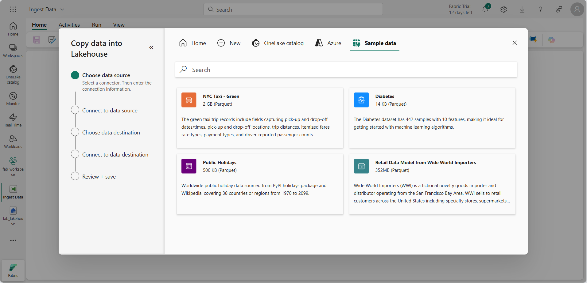

---
lab:
  title: Explorer l’analytique de données dans Microsoft Fabric
  module: Explore fundamentals of large-scale data analytics
---

# Explorer l’analytique de données dans Microsoft Fabric

Dans cet exercice, vous allez explorer l’ingestion et l’analytique de données dans un Lakehouse Microsoft Fabric.

Ce labo prend environ **25** minutes.

> **Remarque** : Vous aurez besoin d’une licence Microsoft Fabric pour effectuer cet exercice. Pour plus d’informations sur l’activation d’une licence d’essai Fabric gratuite, consultez [Bien démarrer avec Fabric](https://learn.microsoft.com/fabric/get-started/fabric-trial). Vous aurez besoin pour cela d’un compte *scolaire* ou *professionnel* Microsoft. Si vous n’en avez pas, vous pouvez vous [inscrire à un essai de Microsoft Office 365 E3 ou supérieur](https://www.microsoft.com/microsoft-365/business/compare-more-office-365-for-business-plans).

*La première fois que vous utilisez une fonctionnalité de Microsoft Fabric, des invites avec des conseils peuvent apparaître. Ignorez-les.*

## Créer un espace de travail

Avant d’utiliser des données dans Fabric, créez un espace de travail avec l’essai gratuit de Fabric activé.

1. Connectez-vous à [Microsoft Fabric](https://app.fabric.microsoft.com) sur `https://app.fabric.microsoft.com`.
1. Dans la barre de menus, en bas à gauche, passez à l’expérience **Engineering données**.

    

1. Dans la barre de menus à gauche, sélectionnez **Espaces de travail** (l’icône ressemble à &#128455;).
1. Créez un nouvel espace de travail avec le nom de votre choix et sélectionnez un mode de licence dans la section **Avancé** qui comprend la capacité Fabric (*Essai*, *Premium* ou *Fabric*).
1. Lorsque votre nouvel espace de travail s’ouvre, il doit être vide.

    

## Créer un lakehouse

Maintenant que vous disposez d’un espace de travail, il est temps de créer un data lakehouse pour vos fichiers de données.

1. Dans la page d’accueil de l’espace de travail, créez un nouveau **lakehouse** du nom de votre choix.

    Au bout d’une minute environ, un nouveau lakehouse est créé :

    

1. Affichez le nouveau lakehouse et notez que le volet **Explorateur de lakehouse** à gauche vous permet de parcourir les tables et les fichiers présents dans le lakehouse :
    - Le dossier **Tables** contient des tables que vous pouvez interroger à l’aide de SQL. Les tables d’un lakehouse Microsoft Fabric sont basées sur le format de fichier *Delta Lake* open source, qui est couramment utilisé dans Apache Spark.
    - Le dossier **Fichiers** contient des fichiers de données du stockage OneLake pour le lakehouse qui ne sont pas associés à des tables delta managées. Vous pouvez également créer des *raccourcis* dans ce dossier pour référencer des données qui sont stockées en externe.

    Actuellement, il n’y a pas de tables ou de fichiers dans le lakehouse.

## Ingérer des données

Un moyen simple d’ingérer des données consiste à utiliser une activité **Copier des données** dans un pipeline afin d’extraire les données d’une source et de les copier dans un fichier dans le lakehouse.

1. Dans la page **Accueil** de votre lakehouse, dans le menu **Obtenir des données**, sélectionnez **Nouveau pipeline de données**, puis créez un pipeline de données nommé **Ingérer des données**.
1. Dans l’Assistant **Copier des données**, dans la page **Choisir une source de données**, sélectionnez **Exemples de données**, puis sélectionnez l’exemple de jeu de donnés **NYC Taxi - Green**.

    

1. Sur la page **Se connecter à la source de données**, affichez les tables de la source de données. Vous devriez voir une table contient des informations sur les trajets en taxi à New York. Sélectionnez ensuite **Suivant** pour accéder à la page **Choisir la destination des données**.
1. Dans la page **Choisir la destination des données**, sélectionnez votre lakehouse existant. Sélectionnez ensuite **Suivant**.
1. Définissez les options de destination des données suivantes, puis sélectionnez **Suivant** :
    - **Dossier racine** : Tables
    - **Paramètres de chargement** : Charger dans la nouvelle table
    - **Nom de la table de destination** : taxi_rides *(vous devrez peut-être attendre que l’aperçu des mappages de colonnes s’affiche pour pouvoir le modifier)*
    - **Mappages de colonnes** : *Laisser les mappages par défaut tels qu’ils sont*
    - **Activer la partition** : *Non sélectionné*
1. Dans la page **Vérifier + enregistrer**, vérifiez que l’option **Démarrer immédiatement le transfert de données** est sélectionnée, puis sélectionnez **Enregistrer + exécuter**.

    Un nouveau pipeline contenant une activité **Copier des données** est créé, comme illustré ici :

    

    Lorsque le pipeline commence à s’exécuter, vous pouvez superviser son statut dans le volet **Sortie** sous le concepteur de pipeline. Cliquez sur l’icône **&#8635;** (*Actualiser*) pour actualiser le statut et patientez jusqu’à ce que l’actualisation aboutisse (ce qui peut prendre 10 minutes ou plus).

1. Dans la barre de menus du hub à gauche, sélectionnez votre lakehouse.
1. Sur la page **Accueil**, dans le volet **Explorateur Lakehouse**, dans le menu **...** du nœud **Tables**, sélectionnez **Actualiser**, puis développez **Tables** pour vérifier que la table **taxi_rides** a été créée.

    > **Remarque** : si la nouvelle table est répertoriée comme *non identifiée*, utilisez l’option de menu **Actualiser** associée pour actualiser la vue.

1. Sélectionnez la table **taxi_rides** pour afficher son contenu.

    

## Interroger des données dans un lakehouse

Maintenant que vous avez ingéré des données dans une table dans le lakehouse, vous pouvez utiliser SQL pour les interroger.

1. En haut à droite de la page Lakehouse, basculez de la vue **Lakehouse** vers le **point de terminaison d’analytique SQL** de votre lakehouse.

1. Dans la barre d’outils, sélectionnez **Nouvelle requête SQL**. Entrez ensuite le code SQL suivant dans l’éditeur de requête :

    ```sql
    SELECT  DATENAME(dw,lpepPickupDatetime) AS Day,
            AVG(tripDistance) As AvgDistance
    FROM taxi_rides
    GROUP BY DATENAME(dw,lpepPickupDatetime)
    ```

1. Sélectionnez le bouton **&#9655; Exécuter** pour exécuter la requête et passer en revue les résultats, qui doivent inclure la distance moyenne de trajet pour chaque jour de la semaine.

    

## Visualiser les données dans un lakehouse

Les lakehouses Microsoft Fabric organisent toutes les tables dans un modèle de données sémantique, que vous pouvez utiliser pour créer des visualisations et des rapports.

1. En bas à gauche de la page, dans le volet **Explorateur**, sélectionnez l’onglet **Modèle** pour voir le modèle de données des tables du lakehouse (inclut les tables système, ainsi que la table **taxi_rides**).
1. Dans la barre d’outils, sélectionnez **Nouveau rapport** pour créer un rapport basé sur **taxi_rides**.
1. Dans le concepteur de rapports :
    1. Dans le volet **Données**, développez la table **taxi_rides** et sélectionnez les champs **lpepPickupDatetime** et **passengerCount**.
    1. Dans le volet **Visualisations**, sélectionnez la visualisation **Graphique linéaire**. Vérifiez ensuite que l’axe **X** contient le **champ lpepPickupDatetime** et que l’axe **Y** contient **Sum of passengerCount**.

        

    > **Conseil** : Vous pouvez utiliser les icônes **>>** pour masquer les volets du concepteur de rapports afin de voir le rapport plus clairement.

1. Dans le menu **Fichier**, sélectionnez **Enregistrer** pour enregistrer le rapport en tant que **Rapport sur les courses en taxi** dans votre espace de travail Fabric.

    Vous trouverez le rapport dans la page de votre espace de travail dans le portail Microsoft Fabric.

## Nettoyer les ressources

Si vous avez terminé d’explorer Microsoft Fabric, vous pouvez supprimer l’espace de travail que vous avez créé pour cet exercice.

1. Dans la barre de gauche, sélectionnez l’icône de votre espace de travail pour afficher tous les éléments qu’il contient.
2. Dans le menu  **...** de la barre d’outils, sélectionnez **Paramètres de l’espace de travail**.
3. Dans la section **Autre**, sélectionnez **Supprimer cet espace de travail**.
