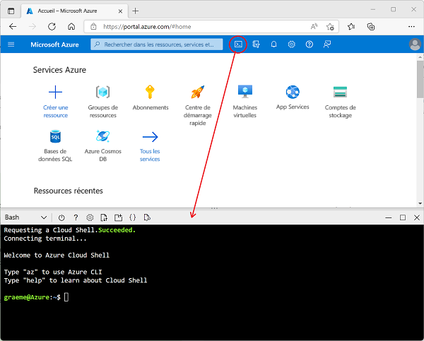

---
lab:
  title: Découvrir Azure Stream Analytics
  module: Explore fundamentals of real-time analytics
---

# <a name="explore-azure-stream-analytics"></a>Découvrir Azure Stream Analytics

Dans cet exercice, vous allez provisionner un espace de travail Azure Stream Analytics dans votre abonnement Azure et l’utiliser pour traiter un flux de données en temps réel.

Ce labo prend environ **15** minutes.

## <a name="before-you-start"></a>Avant de commencer

Vous avez besoin d’un [abonnement Azure](https://azure.microsoft.com/free) dans lequel vous avez un accès administratif.

## <a name="create-azure-resources"></a>Créer des ressources Azure

1. Connectez-vous à votre abonnement Azure dans le [portail Azure](https://portal.azure.com) en utilisant vos informations d’identification associées.

1. Utilisez le bouton **[\>_]** à droite de la barre de recherche, en haut de la page, pour créer un environnement Cloud Shell dans le portail Azure, en sélectionnant un environnement ***Bash*** et en créant le stockage si vous y êtes invité. Cloud Shell fournit une interface de ligne de commande dans un volet situé en bas du portail Azure, comme illustré ici :

    

1. Dans Azure Cloud Shell, entrez la commande suivante pour télécharger les fichiers dont vous avez besoin pour cet exercice.

    ```bash
    git clone https://github.com/MicrosoftLearning/DP-900T00A-Azure-Data-Fundamentals dp-900
    ```

1. Attendez la fin de la commande, puis entrez la commande suivante pour remplacer le répertoire actif par le dossier contenant les fichiers de cet exercice.

    ```bash
    cd dp-900/streaming
    ```

1. Entrez la commande suivante pour exécuter un script qui crée les ressources Azure dont vous aurez besoin dans cet exercice.

    ```bash
    bash setup.sh
    ```

    Attendez que le script s’exécute et réalise les actions suivantes :

    1. Installe les extensions d’Azure CLI nécessaires pour créer des ressources (*vous pouvez ignorer les avertissements concernant les extensions expérimentales*)
    1. Identifie le groupe de ressources Azure fourni pour cet exercice.
    1. Crée une ressource *Azure IoT Hub*, qui sera utilisée pour recevoir un flux de données provenant d’un appareil simulé.
    1. Crée un *compte de Stockage Azure*, qui sera utilisé pour stocker les données traitées.
    1. Crée une tâche *Azure Stream Analytics*, qui traite les données d’appareil entrantes en temps réel et écrit les résultats dans le compte de stockage.

## <a name="explore-the-azure-resources"></a>Explorer les ressources Azure

1. Dans le [Portail Azure](https://portal.azure.com?azure-portal=true) de la page d'accueil, sélectionnez **Groupes de ressources** pour consulter les groupes de ressources de votre abonnement. Cela doit inclure le groupe de ressources **learn*xxxxxxxxxxxxxxxxx...** * identifié par le script d’installation.
2. Sélectionnez le groupe de ressources **learn*xxxxxxxxxxxxxxxxx...** *, puis examinez les ressources qu’il doit normalement contenir, à savoir :
    - Un *IoT Hub* nommé**iothub*xxxxxxxxxxxxx***, qui est utilisé pour recevoir les données entrantes de l’appareil.
    - Un *compte Stockage* nommé**store*xxxxxxxxxxxx***, dans lequel les résultats du traitement des données seront écrits.
    - Une *tâche Stream Analytics* nommée **stream*xxxxxxxxxxxxx***, qui sera utilisée pour traiter les données de diffusion en continu.

    Si ces trois ressources ne sont pas répertoriées, cliquez sur le bouton **&#8635 ; Actualiser** jusqu’à ce qu’elles apparaissent.

 3. Sélectionnez la tâche Stream Analytics **stream*xxxxxxxxxxxxx*** et affichez les informations sur sa page **Vue d’ensemble**, en notant les détails suivants :
    - La tâche comporte une *entrée* nommée **iotinput**, et une *sortie* nommée **bloboutput**. Ils font référence à IoT Hub et au compte Stockage créé par le script d’installation.
    - La tâche comporte une *requête*, qui lit les données à partir de l’entrée **iotinput** et les agrège en comptant le nombre de messages traités toutes les 10 secondes ; elle écrit les résultats dans la sortie **bloboutput**.

## <a name="use-the-resources-to-analyze-streaming-data"></a>Utilisez les ressources pour analyser les données de diffusion en continu

1. En haut de la page **Vue d’ensemble** pour la tâche Stream Analytics, sélectionnez le bouton **&#9655; Démarrer**, puis dans le volet **Démarrer la tâche**, sélectionnez **Démarrer** afin de démarrer la tâche.
2. Attendez la notification indiquant que la tâche de diffusion en continu a démarré avec succès.
3. Revenez à Azure Cloud Shell, puis entrez la commande suivante pour simuler un appareil qui envoie des données à IoT Hub.

    ```
    bash iotdevice.sh
    ```

4. Attendez que la simulation démarre, ce qui est indiqué par la sortie suivante :

    ```
    Device simulation in progress: 6%|#    | 7/120 [00:08<02:21, 1.26s/it]
    ```

5. Pendant que la simulation est en cours, retournez dans le portail Azure, retournez à la page du groupe de ressources **learn*xxxxxxxxxxxxxxxxx...** *, et sélectionnez le compte de stockage **store*xxxxxxxxxxxx***.
6. Dans le volet situé à gauche du volet du compte de stockage, sélectionnez l’onglet **Conteneurs**.
7. Ouvrez le conteneur de **données**.
8. Dans le conteneur de **données**, parcourez l’arborescence des dossiers, qui comprend un dossier pour l’année en cours, avec des sous-dossiers pour le mois, le jour et l’heure.
9. Dans le dossier de l’heure, notez le fichier qui a été créé et qui devrait avoir un nom similaire à **0_xxxxxxxxxxxxxxxx.json**.
10. Dans le menu **...** du fichier (à droite des détails du fichier), sélectionnez **Afficher/modifier**, puis examinez le contenu du fichier qui devrait se composer d’un enregistrement JSON pour chaque période de 10 secondes, indiquant le nombre de messages reçus des appareils IoT, comme suit :

    ```
    {"starttime":"2021-10-23T01:02:13.2221657Z","endtime":"2021-10-23T01:02:23.2221657Z","device":"iotdevice","messages":2}
    {"starttime":"2021-10-23T01:02:14.5366678Z","endtime":"2021-10-23T01:02:24.5366678Z","device":"iotdevice","messages":3}
    {"starttime":"2021-10-23T01:02:15.7413754Z","endtime":"2021-10-23T01:02:25.7413754Z","device":"iotdevice","messages":4}
    ...
    ```

11. Utilisez le bouton **&#8635; Actualiser** pour actualiser le fichier, en notant que des résultats supplémentaires sont écrits dans le fichier à mesure que la tâche Stream Analytics traite les données de l’appareil en temps réel, car elles sont transmises de l’appareil à IOT Hub.
12. Revenez à Azure Cloud Shell et attendez la fin de la simulation de l’appareil (environ 3 minutes).
13. De retour sur le Portail Azure, actualisez le fichier une fois de plus pour voir l’ensemble complet des résultats qui ont été produits pendant la simulation.
14. Retournez dans le groupe de ressources **learn*xxxxxxxxxxxxxxxxx...** * et rouvrez le travail Stream Analytics **stream*xxxxxxxxxxxxx***.
15. En haut de la page de la tâche Stream Analytics, utilisez le bouton **&#11036; Arrêter** pour arrêter la tâche, en confirmant lorsque vous y êtes invité.

> **Remarque** : Si vous avez fini d’explorer la solution de streaming, vous pouvez supprimer le groupe de ressources que vous avez créé dans cet exercice.
