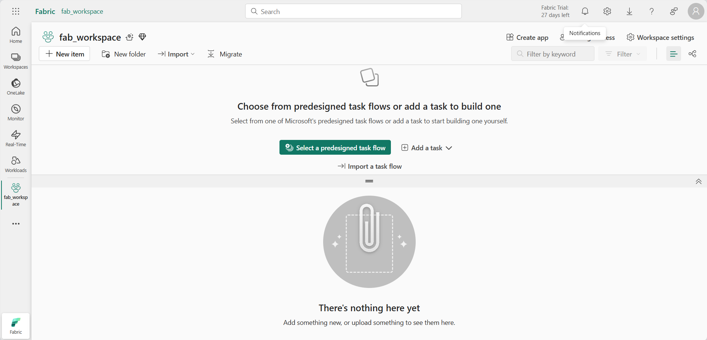

---
lab:
  title: Explorer l’analytique en temps réel dans Microsoft Fabric
  module: Explore fundamentals of large-scale data analytics
---

# Explorer l’analytique en temps réel dans Microsoft Fabric

Dans cet exercice, vous allez explorer l’analytique en temps réel dans Microsoft Fabric.

Ce labo prend environ **25** minutes.

> **Remarque** : Vous aurez besoin d’une licence Microsoft Fabric pour effectuer cet exercice. Pour plus d’informations sur l’activation d’une licence d’essai Fabric gratuite, consultez [Bien démarrer avec Fabric](https://learn.microsoft.com/fabric/get-started/fabric-trial). Vous aurez besoin pour cela d’un compte *scolaire* ou *professionnel* Microsoft. Si vous n’en avez pas, vous pouvez vous [inscrire à un essai de Microsoft Office 365 E3 ou supérieur](https://www.microsoft.com/microsoft-365/business/compare-more-office-365-for-business-plans).

## Créer un espace de travail

Avant d’utiliser des données dans Fabric, créez un espace de travail avec l’essai gratuit de Fabric activé.

1. Connectez-vous à [Microsoft Fabric](https://app.fabric.microsoft.com) sur `https://app.fabric.microsoft.com`.
2. Dans la barre de menus à gauche, sélectionnez **Espaces de travail** (l’icône ressemble à &#128455;).
3. Créez un nouvel espace de travail avec le nom de votre choix et sélectionnez un mode de licence dans la section **Avancé** qui comprend la capacité Fabric (*Essai*, *Premium* ou *Fabric*).
4. Lorsque votre nouvel espace de travail s’ouvre, il doit être vide.

    

## Créer une base de données KQL

Maintenant que vous disposez d’un espace de travail, vous pouvez créer une base de données KQL pour stocker des données en temps réel.

1. En bas à gauche du portail, passez à l’expérience **Analytique en temps réel**.

    

    La page d’accueil de l’analytique en temps réel comprend des vignettes permettant de créer des ressources couramment utilisées pour l’analyse des données en temps réel

2. Dans la page d’accueil de l’analytique en temps réel, créez une **base de données KQL** avec le nom de votre choix.

    Au bout d’une minute environ, une nouvelle base de données KQL est créée :

    

    Actuellement, il n’existe aucune table dans la base de données.

## Créer un flux d’événements

Les flux d’événements offrent un moyen évolutif et flexible d’ingérer des données en temps réel à partir d’une source de streaming.

1. Dans la barre de menus à gauche, sélectionnez la page **Accueil** pour l’expérience d’analytique en temps réel.
1. Dans la page d’accueil, sélectionnez la vignette pour créer un **flux d’événements** avec le nom de votre choix.

    Après un court laps de temps, le concepteur visuel de votre flux d’événements s’affiche.

    

    Le canevas du concepteur visuel montre une source qui se connecte à votre flux d’événements qui, à son tour, est connecté à une destination.

1. Dans le canevas du concepteur, dans la liste **Nouvelle source** de votre source, sélectionnez **Échantillon de données**. Ensuite, dans le volet **Échantillon de données**, spécifiez le nom **taxis** et sélectionnez l’échantillon de données **Yellow Taxi** (qui représente les données collectées relatives aux trajets en taxi). Sélectionnez ensuite **Ajouter**.
1. Sous le canevas du concepteur, sélectionnez l’onglet **Aperçu des données** pour afficher un aperçu des données en cours de streaming à partir de la source :

    

1. Dans le canevas du concepteur, dans la liste **Nouvelle destination** de votre destination, sélectionnez **Base de données KQL**. Ensuite, dans le volet **Base de données KQL**, spécifiez le nom de destination **taxi-data** et sélectionnez votre espace de travail et votre base de données KQL. Sélectionnez ensuite **Créer et configurer**.
1. Dans l’Assistant **Ingérer des données**, dans la page **Destination**, sélectionnez **Nouvelle table** et entrez le nom de la table **taxi-data**. Sélectionnez ensuite **Suivant : Source**.
1. Dans la page **Source**, examinez le nom de connexion aux données par défaut, puis sélectionnez **Suivant : Schéma**.
1. Dans la page **Schéma**, remplacez le **Format de données** TXT par **JSON** et affichez un aperçu pour vérifier que ce format génère plusieurs colonnes de données. Ensuite, sélectionnez **Suivant : Résumé**.
1. Dans la page **Résumé**, attendez que l’ingestion continue soit établie, puis sélectionnez **Fermer**.
1. Vérifiez que votre flux d’événements terminé ressemble à ceci :

    

## Interroger des données en temps réel dans une base de données KQL

Votre flux d’événements remplit en continu une table dans votre base de données KQL, ce qui vous permet d’interroger les données en temps réel.

1. Dans le hub de menu à gauche, sélectionnez votre base de données KQL (ou sélectionnez votre espace de travail et recherchez-y votre base de données KQL).
1. Dans le menu **...** de la table **taxi-data** (qui a été créée par votre flux d’événements), sélectionnez **Interroger la table > Données ingérées au cours des dernières 24 heures**.

    

1. Affichez les résultats de la requête, qui doit être une requête KQL comme suit :

    ```kql
    ['taxi-data']
    | where ingestion_time() between (now(-1d) .. now())
    ```

    Les résultats montrent toutes les données de taxi ingérées à partir de la source de streaming au cours des dernières 24 heures.

1. Remplacez l’ensemble du code de requête KQL dans la moitié supérieure de l’éditeur de requête par le code suivant :

    ```kql
    // This query returns the number of taxi pickups per hour
    ['taxi-data']
    | summarize PickupCount = count() by bin(tpep_pickup_datetime, 1h)
    ```

1. Utilisez le bouton **&#9655; Exécuter** pour exécuter la requête et afficher les résultats, qui montrent le nombre de courses de taxi pour chaque heure.

## Nettoyer les ressources

Si vous avez fini d’explorer l’analytique en temps réel dans Microsoft Fabric, vous pouvez supprimer l’espace de travail que vous avez créé pour cet exercice.

1. Dans la barre de gauche, sélectionnez l’icône de votre espace de travail pour afficher tous les éléments qu’il contient.
2. Dans le menu  **...** de la barre d’outils, sélectionnez **Paramètres de l’espace de travail**.
3. Dans la section **Autre**, sélectionnez **Supprimer cet espace de travail**.
