---
lab:
  title: "Découvrir les notions de base de la visualisation des données avec Power\_BI"
  module: Explore fundamentals of data visualization
---

# <a name="explore-fundamentals-of-data-visualization-with-power-bi"></a>Découvrir les notions de base de la visualisation des données avec Power BI

Dans cet exercice, vous allez utiliser Microsoft Power BI Desktop pour créer un modèle de données et un rapport contenant des visualisations de données interactives.

Ce labo prend environ **20** minutes.

## <a name="before-you-start"></a>Avant de commencer

Vous avez besoin d’un [abonnement Azure](https://azure.microsoft.com/free) dans lequel vous avez un accès administratif.

### <a name="install-power-bi-desktop"></a>Installer Power BI Desktop

Si Microsoft Power BI Desktop n’est pas déjà installé sur votre ordinateur Windows, vous pouvez le télécharger et l’installer gratuitement.

1. Téléchargez le programme d’installation de Power BI Desktop à partir de [https://aka.ms/power-bi-desktop](https://aka.ms/power-bi-desktop?azure-portal=true).
1. When the file has downloaded, open it, and use the setup wizard to install Power BI Desktop on your computer. This insatllation may take a few minutes.

## <a name="import-data"></a>Importer des données

1. Open Power BI Desktop. The application interface should look similar to this:

    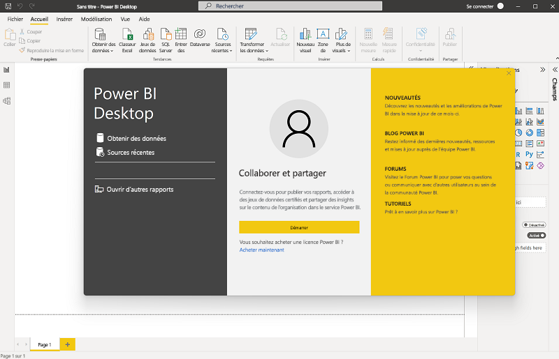

    Vous êtes maintenant prêt à importer les données pour votre rapport.

1. Dans l’écran d’accueil de Power BI Desktop, sélectionnez **Obtenir des données**, puis dans la liste des sources de données, sélectionnez **Web**, puis **Connecter**.

    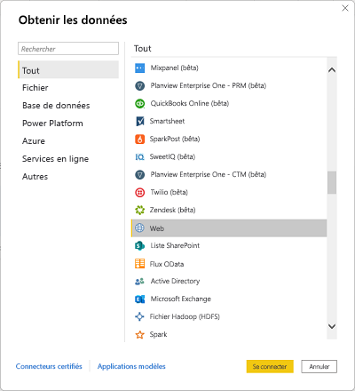

1. Dans la boîte de dialogue **À partir du web**, entrez l’URL suivante, puis sélectionnez **OK** :

    ```
    https://github.com/MicrosoftLearning/DP-900T00A-Azure-Data-Fundamentals/raw/master/power-bi/customers.csv
    ```

1. Dans la boîte de dialogue Accéder au contenu web, sélectionnez **Se connecter**.

1. Verify that the URL opens a dataset containing customer data, as shown below. Then select <bpt id="p1">**</bpt>Load<ept id="p1">**</ept> to load the data into the data model for your report.

    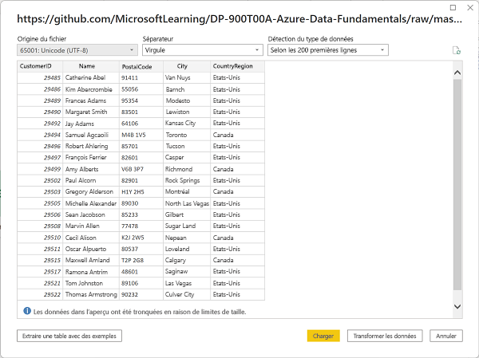

1. Dans la fenêtre principale de Power BI Desktop, dans le menu Données, sélectionnez **Obtenir des données**, puis sélectionnez **Web** :

    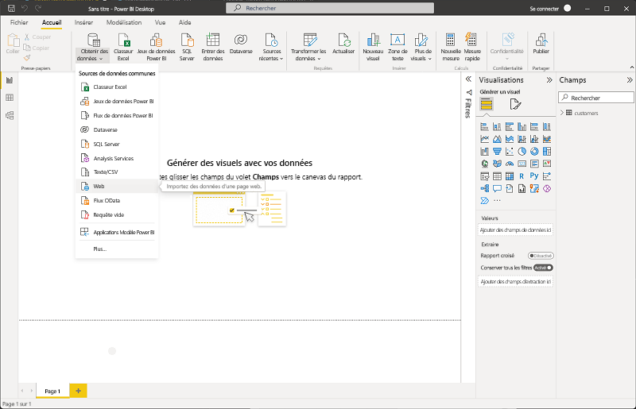

1. Dans la boîte de dialogue **À partir du web**, entrez l’URL suivante, puis sélectionnez **OK** :

    ```
    https://github.com/MicrosoftLearning/DP-900T00A-Azure-Data-Fundamentals/raw/master/power-bi/products.csv
    ```

1. Dans la boîte de dialogue, sélectionnez **Charger** pour charger les données produit de ce fichier dans le modèle de données.

1. Répétez les trois étapes précédentes pour importer un troisième jeu de données contenant les données de commande à partir de l’URL suivante :

    ```
    https://github.com/MicrosoftLearning/DP-900T00A-Azure-Data-Fundamentals/raw/master/power-bi/orders.csv
    ```

## <a name="explore-a-data-model"></a>Explorer un modèle de données

Les trois tables de données que vous avez importées ont été chargées dans un modèle de données que vous allez maintenant explorer et affiner.

1. In Power BI Desktop, on the left-side edge, select the <bpt id="p1">**</bpt>Model<ept id="p1">**</ept> tab, and then arrange the tables in the model so you can see them. You can hide the panes on the right side by using the <bpt id="p1">**</bpt><ph id="ph1">&gt;&gt;</ph><ept id="p1">**</ept> icons:

    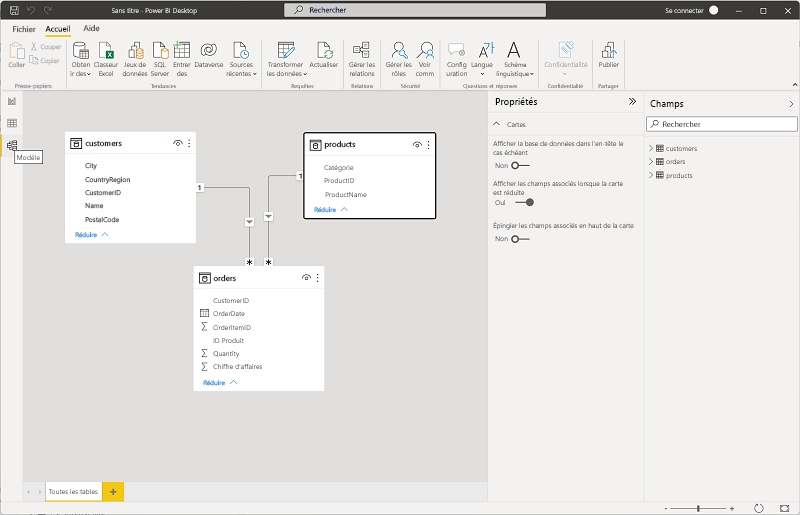

1. Dans la table **orders**, sélectionnez le champ **Chiffre d’affaires**, puis dans le volet **Propriétés**, définissez sa propriété **Format** sur **Devise** :

    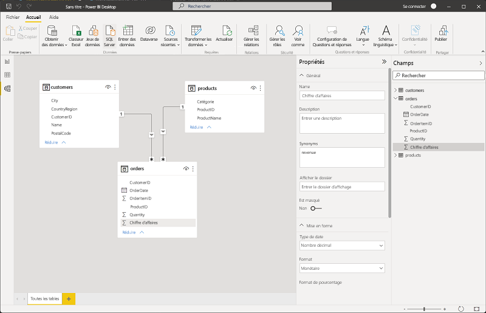

    Cette étape permet de s’assurer que les valeurs de chiffre d’affaires sont affichées sous forme de devise dans les visualisations de rapport.

1. In the products table, right-click the <bpt id="p1">**</bpt>Category<ept id="p1">**</ept> field (or open its <bpt id="p2">**</bpt><ph id="ph1">&amp;vellip;</ph><ept id="p2">**</ept> menu) and select <bpt id="p3">**</bpt>Create hierarchy<ept id="p3">**</ept>. This step creates a hierarchy named <bpt id="p1">**</bpt>Category Hierarchy<ept id="p1">**</ept>. You may need to expand or scroll in the <bpt id="p1">**</bpt>products<ept id="p1">**</ept> table to see this - you can also see it in the <bpt id="p2">**</bpt>Fields<ept id="p2">**</ept> pane:

    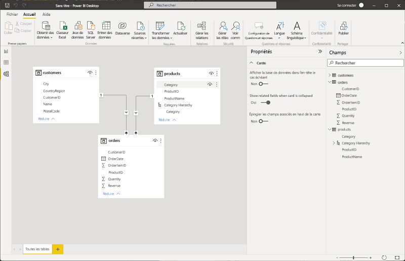

1. In the products table, right-click the <bpt id="p1">**</bpt>ProductName<ept id="p1">**</ept> field (or open its <bpt id="p2">**</bpt><ph id="ph1">&amp;vellip;</ph><ept id="p2">**</ept> menu) and select <bpt id="p3">**</bpt>Add to hierarchy<ept id="p3">**</ept><ph id="ph2"> &gt; </ph><bpt id="p4">**</bpt>Category Hierarchy<ept id="p4">**</ept>. This adds the <bpt id="p1">**</bpt>ProductName<ept id="p1">**</ept> field to the hierarchy you created previously.
1. In the <bpt id="p1">**</bpt>Fields<ept id="p1">**</ept> pane, right-click <bpt id="p2">**</bpt>Category Hierarchy<ept id="p2">**</ept> (or open its <bpt id="p3">**</bpt>...<ept id="p3">**</ept> menu) and select <bpt id="p4">**</bpt>Rename<ept id="p4">**</ept>. Then rename the hierarchy to <bpt id="p1">**</bpt>Categorized Product<ept id="p1">**</ept>.

    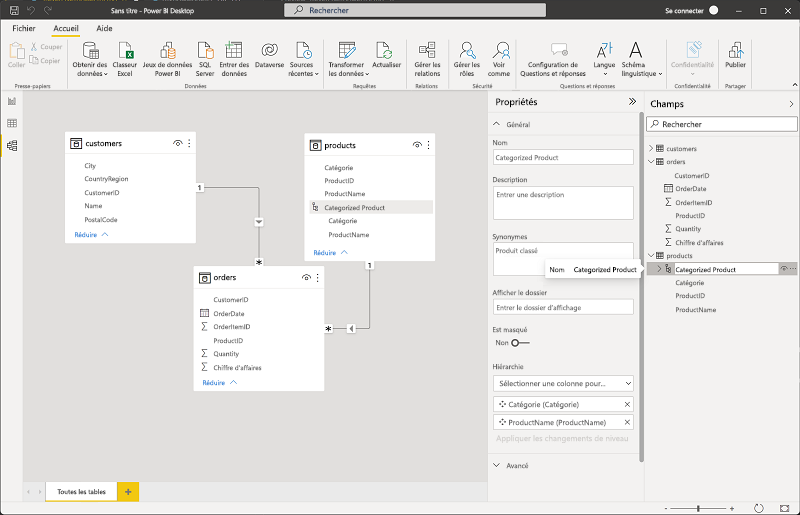

1. Sur le côté gauche, sélectionnez l’onglet **Données**, puis dans le volet **Champs**, sélectionnez la table **customers**.
1. Sélectionnez l’en-tête de colonne **Ville**, puis définissez sa propriété de **Catégorie de données** sur **Ville** :

    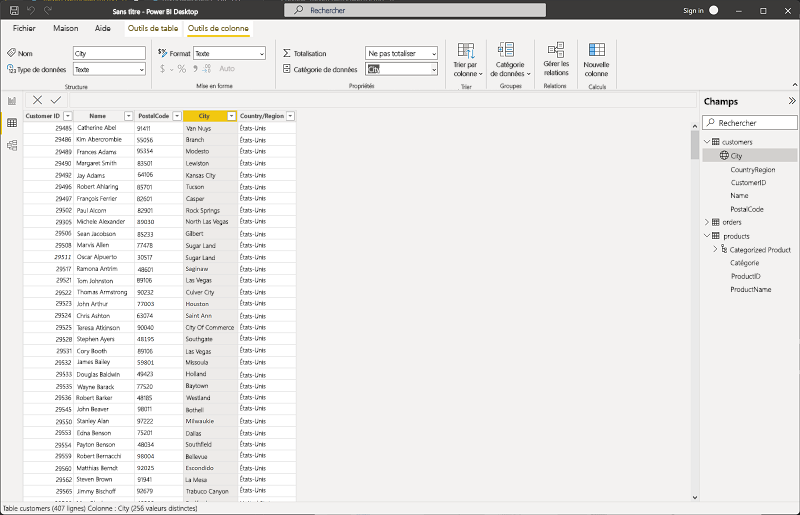

    Cette étape permet de s’assurer que les valeurs de cette colonne sont interprétées comme des noms de villes, ce qui peut être utile si vous envisagez d’inclure des visualisations de carte.

## <a name="create-a-report"></a>Créer un rapport

Now you're almost ready to create a report. First you need to check some settings to ensure all visualizations are enabled.

1. On the <bpt id="p1">**</bpt>File<ept id="p1">**</ept> menu, select <bpt id="p2">**</bpt>Options and Settings<ept id="p2">**</ept>. Then select <bpt id="p1">**</bpt>Options<ept id="p1">**</ept>, and in the <bpt id="p2">**</bpt>Security<ept id="p2">**</ept> section, ensure that <bpt id="p3">**</bpt>Use Map and Filled Map visuals<ept id="p3">**</ept> is enabled and select <bpt id="p4">**</bpt>OK<ept id="p4">**</ept>.

    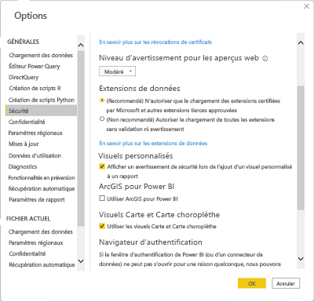

    Cette propriété vous permet de vous assurer que vous pouvez inclure des visualisations de carte dans les rapports.

1. Sur le côté gauche, sélectionnez l’onglet **Rapport** et affichez l’interface de création de rapport.

    

1. In the ribbon, above the report design surface, select <bpt id="p1">**</bpt>Text Box<ept id="p1">**</ept> and add a text box containing the text <bpt id="p2">**</bpt>Sales Report<ept id="p2">**</ept> to the report. Format the text to make it bold with a font size of 32.

    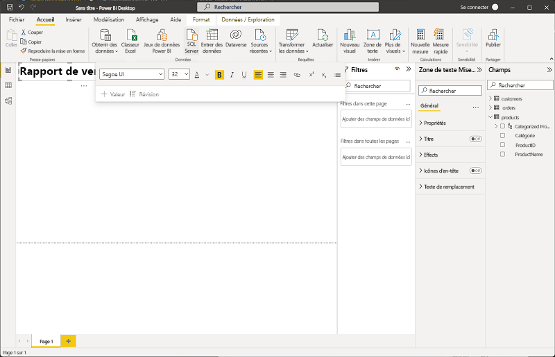

1. Une fois le fichier téléchargé, ouvrez-le et utilisez l’Assistant d’installation pour installer Power BI Desktop sur votre ordinateur.

    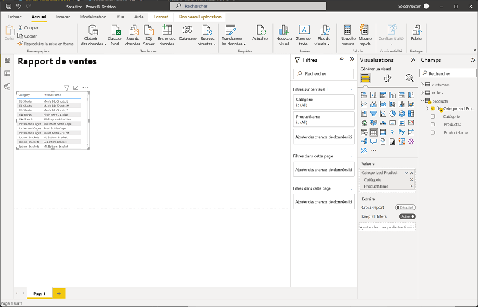

1. Cette installation peut prendre quelques minutes.

    The revenue is formatted as currency, as you specified in the model. However, you didn't specify the number of decimal places, so the values include fractional amounts. It won't matter for the visualizations you're going to create, but you could go back to the <bpt id="p1">**</bpt>Model<ept id="p1">**</ept> or <bpt id="p2">**</bpt>Data<ept id="p2">**</ept> tab and change the decimal places if you wish.

    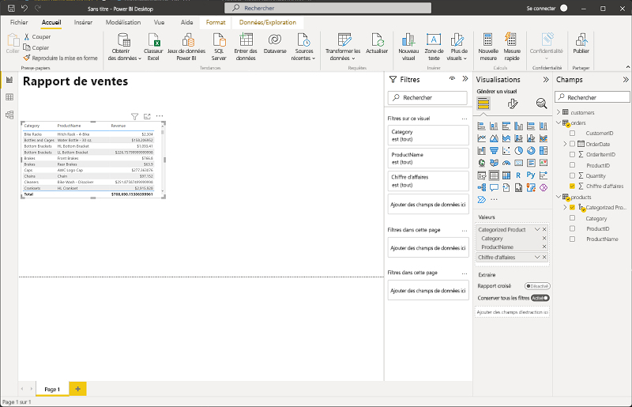

1. With the table still selected, in the <bpt id="p1">**</bpt>Visualizations<ept id="p1">**</ept> pane, select the <bpt id="p2">**</bpt>Stacked column chart<ept id="p2">**</ept> visualization. The table is changed to a column chart showing revenue by category.

    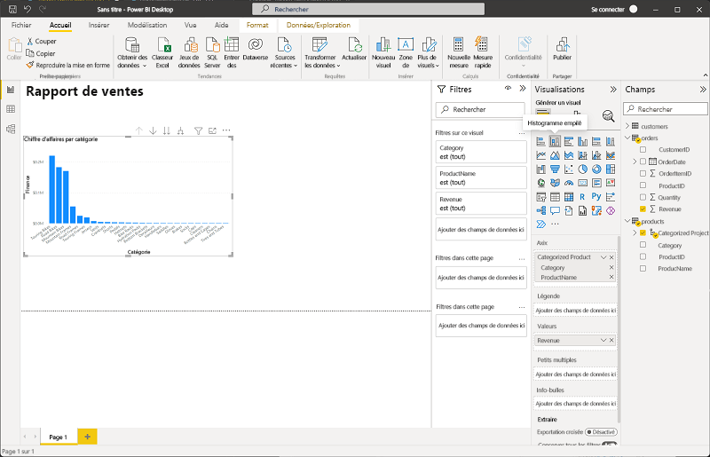

1. Ouvrez Power BI Desktop.

    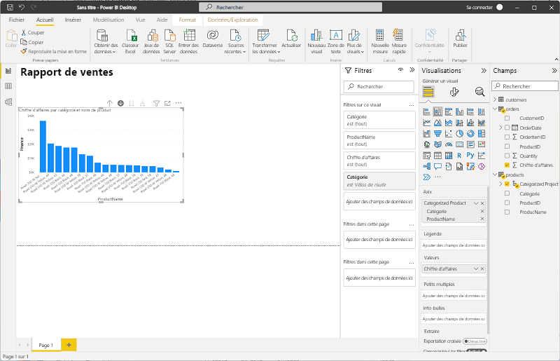

1. L’interface de l’application doit ressembler à ceci :
1. Select a blank area of the report, and then in the <bpt id="p1">**</bpt>Fields<ept id="p1">**</ept> pane, select the <bpt id="p2">**</bpt>Quantity<ept id="p2">**</ept> field in the <bpt id="p3">**</bpt>orders<ept id="p3">**</ept> table and the <bpt id="p4">**</bpt>Category<ept id="p4">**</ept> field in the <bpt id="p5">**</bpt>products<ept id="p5">**</ept> table. This step results in another column chart showing sales quantity by product category.
1. Une fois le nouvel histogramme sélectionné, dans le volet **Visualisations**, sélectionnez **Graphique à secteurs**, puis redimensionnez le graphique et positionnez-le en regard de l’histogramme par catégorie.

    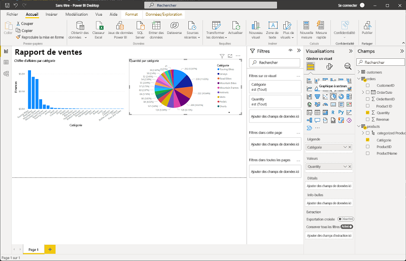

1. Select a blank area of the report, and then in the <bpt id="p1">**</bpt>Fields<ept id="p1">**</ept> pane, select the <bpt id="p2">**</bpt>City<ept id="p2">**</ept> field in the <bpt id="p3">**</bpt>customers<ept id="p3">**</ept> table and then select the <bpt id="p4">**</bpt>Revenue<ept id="p4">**</ept> field in the <bpt id="p5">**</bpt>orders<ept id="p5">**</ept> table. This results in a map showing sales revenue by city. Rearrange and resize the visualizations as needed:

    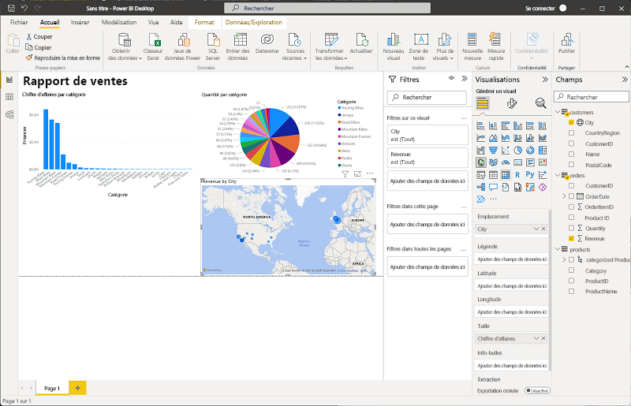

1. In the map, note that you can drag, double-click, use a mouse-wheel, or pinch and drag on a touch screen to interact. Then select a specific city, and note that the other visualizations in the report are modified to highlight the data for the selected city.

    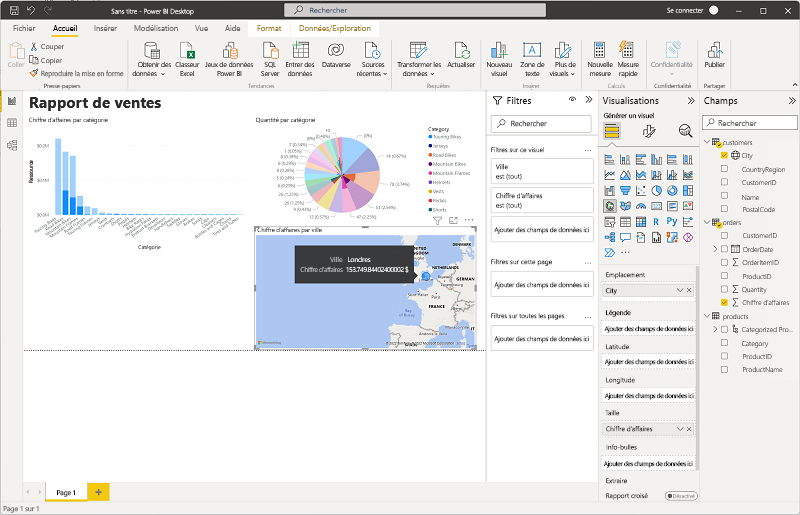

1. On the <bpt id="p1">**</bpt>File<ept id="p1">**</ept> menu, select <bpt id="p2">**</bpt>Save<ept id="p2">**</ept>. Then save the file with an appropriate .pbix file name. You can open the file and explore data modeling and visualization further at your leisure.

Si vous avez un abonnement au [service Power BI](https://www.powerbi.com/?azure-portal=true), vous pouvez vous connecter à votre compte et publier le rapport dans un espace de travail Power BI. 
