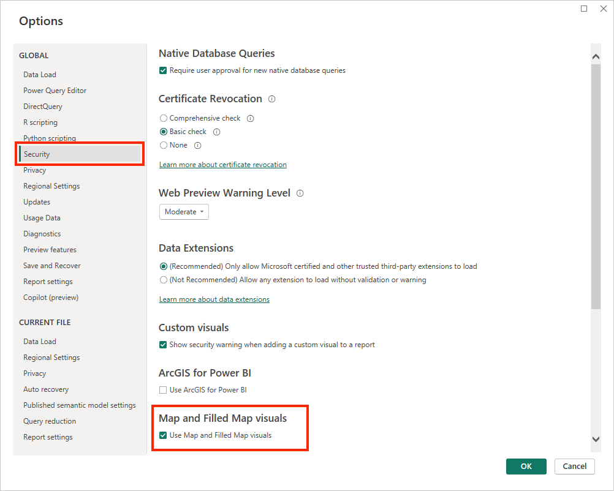

---
lab:
  title: "Découvrir les notions de base de la visualisation des données avec Power\_BI"
  module: Explore fundamentals of data visualization
---

# <a name="explore-fundamentals-of-data-visualization-with-power-bi"></a>Découvrir les notions de base de la visualisation des données avec Power BI

Dans cet exercice, vous allez utiliser Microsoft Power BI Desktop pour créer un modèle de données et un rapport contenant des visualisations de données interactives.

Ce labo prend environ **20** minutes.

## <a name="before-you-start"></a>Avant de commencer

Vous avez besoin d’un [abonnement Azure](https://azure.microsoft.com/free) dans lequel vous avez un accès administratif.

### <a name="install-power-bi-desktop"></a>Installer Power BI Desktop

Si Microsoft Power BI Desktop n’est pas déjà installé sur votre ordinateur Windows, vous pouvez le télécharger et l’installer gratuitement.

1. Téléchargez le programme d’installation de Power BI Desktop à partir de [https://aka.ms/power-bi-desktop](https://aka.ms/power-bi-desktop?azure-portal=true).
1. Une fois le fichier téléchargé, ouvrez-le et utilisez l’Assistant d’installation pour installer Power BI Desktop sur votre ordinateur. Cette installation peut prendre quelques minutes.

## <a name="import-data"></a>Importer des données

1. Ouvrez Power BI Desktop. L’interface de l’application doit ressembler à ceci :

    

    Vous êtes maintenant prêt à importer les données pour votre rapport.

1. Dans l’écran d’accueil de Power BI Desktop, sélectionnez **Obtenir des données**, puis dans la liste des sources de données, sélectionnez **Web**, puis **Connecter**.

    

1. Dans la boîte de dialogue **À partir du web**, entrez l’URL suivante, puis sélectionnez **OK** :

    ```
    https://github.com/MicrosoftLearning/DP-900T00A-Azure-Data-Fundamentals/raw/master/power-bi/customers.csv
    ```

1. Dans la boîte de dialogue Accéder au contenu web, sélectionnez **Se connecter**.

1. Vérifiez que l’URL ouvre un jeu de données contenant les données client, comme indiqué ci-dessous. Sélectionnez ensuite **Charger** pour charger les données dans le modèle de données de votre rapport.

    

1. Dans la fenêtre principale de Power BI Desktop, dans le menu Données, sélectionnez **Obtenir des données**, puis sélectionnez **Web** :

    

1. Dans la boîte de dialogue **À partir du web**, entrez l’URL suivante, puis sélectionnez **OK** :

    ```
    https://github.com/MicrosoftLearning/DP-900T00A-Azure-Data-Fundamentals/raw/master/power-bi/products.csv
    ```

1. Dans la boîte de dialogue, sélectionnez **Charger** pour charger les données produit de ce fichier dans le modèle de données.

1. Répétez les trois étapes précédentes pour importer un troisième jeu de données contenant les données de commande à partir de l’URL suivante :

    ```
    https://github.com/MicrosoftLearning/DP-900T00A-Azure-Data-Fundamentals/raw/master/power-bi/orders.csv
    ```

## <a name="explore-a-data-model"></a>Explorer un modèle de données

Les trois tables de données que vous avez importées ont été chargées dans un modèle de données que vous allez maintenant explorer et affiner.

1. Dans Power BI Desktop, sur le côté gauche, sélectionnez l’onglet **Modèle**, puis réorganisez les tables dans le modèle afin de les voir. Vous pouvez masquer les volets sur le côté droit à l’aide des icônes **>>** :

    

1. Dans la table **orders**, sélectionnez le champ **Chiffre d’affaires**, puis dans le volet **Propriétés**, définissez sa propriété **Format** sur **Devise** :

    

    Cette étape permet de s’assurer que les valeurs de chiffre d’affaires sont affichées sous forme de devise dans les visualisations de rapport.

1. Dans la table products, cliquez avec le bouton droit sur le champ **Catégorie** (ou ouvrez son menu **&vellip;** ) et sélectionnez **Créer une hiérarchie**. Cette étape crée une hiérarchie nommée **Hiérarchie de catégories**. Vous devrez peut-être développer ou faire défiler la table **products** pour voir cette hiérarchie. Vous pouvez également la voir dans le volet **Champs** :

    

1. Dans la table products, cliquez avec le bouton droit sur le champ **ProductName** (ou ouvrez son menu **&vellip;** ) et sélectionnez **Ajouter à la hiérarchie** > **Hiérarchie de catégories**. Cela ajoute le champ **ProductName** à la hiérarchie que vous avez créée précédemment.
1. Dans le volet **Champs**, cliquez avec le bouton droit sur **Hiérarchie de catégories** (ou ouvrez son menu **...**) et sélectionnez **Renommer**. Ensuite, renommez la hiérarchie en **Produits par catégorie**.

    

1. Sur le côté gauche, sélectionnez l’onglet **Données**, puis dans le volet **Champs**, sélectionnez la table **customers**.
1. Sélectionnez l’en-tête de colonne **Ville**, puis définissez sa propriété de **Catégorie de données** sur **Ville** :

    

    Cette étape permet de s’assurer que les valeurs de cette colonne sont interprétées comme des noms de villes, ce qui peut être utile si vous envisagez d’inclure des visualisations de carte.

## <a name="create-a-report"></a>Créer un rapport

Maintenant, vous êtes presque prêt à créer un rapport. Tout d’abord, vous devez vérifier certains paramètres pour vous assurer que toutes les visualisations sont activées.

1. Dans le menu **Fichier**, sélectionnez **Options et paramètres**. Sélectionnez ensuite **Options**, puis, dans la section **Sécurité**, assurez-vous que l’option **Utiliser les visuels de carte et de carte remplie** est activée, puis sélectionnez **OK**.

    

    Cette propriété vous permet de vous assurer que vous pouvez inclure des visualisations de carte dans les rapports.

1. Sur le côté gauche, sélectionnez l’onglet **Rapport** et affichez l’interface de création de rapport.

    

1. Dans le ruban, au-dessus de l’aire de conception du rapport, sélectionnez **Zone de texte** et ajoutez une zone de texte contenant le texte **Rapport des ventes** au rapport. Formatez le texte pour le mettre en gras avec une taille de police de 32.

    

1. Sélectionnez une zone vide dans le rapport pour désélectionner la zone de texte. Ensuite, dans le volet **Champs**, développez **Produits** et sélectionnez le champ **Produits catégorisés**. Cette étape ajoute une table au rapport.

    

1. Avec la table toujours sélectionnée, dans le volet **Champs**, développez **Commandes** et sélectionnez **Chiffre d’affaires**. Une colonne Chiffre d’affaires est ajoutée à la table. Vous devrez peut-être agrandir la table pour la voir.

    Le chiffre d’affaires est mis en forme en tant que devise, comme vous l’avez spécifié dans le modèle. Toutefois, vous n’avez pas spécifié le nombre de décimales, donc les valeurs incluent des montants fractionnaires. Cela n’a pas d’importance pour les visualisations que vous allez créer, mais si vous le souhaitez, vous pouvez revenir à l’onglet **Modèle** ou **Données** et changer le format des décimales.

    

1. La table étant toujours sélectionnée, dans le volet **Visualisations**, sélectionnez la visualisation **Histogramme empilé**. La table est remplacée par un histogramme présentant le chiffre d’affaires par catégorie.

    

1. Au-dessus de l’histogramme sélectionné, sélectionnez l’icône **&#8595;** pour activer l’exploration. Ensuite, dans le graphique, sélectionnez la deuxième colonne (*Vélos route*) pour explorer et voir le chiffre d’affaires des produits individuels dans cette catégorie. Cette fonctionnalité est possible, car vous avez défini une hiérarchie de catégories et de produits.

    

1. Utilisez l’icône **&#x2191;** pour remonter jusqu’au niveau de la catégorie. Sélectionnez ensuite l’icône **(** &#8595; **)** pour désactiver la fonctionnalité d’exploration.
1. Sélectionnez une zone vide du rapport, puis dans le volet **Champs**, sélectionnez le champ **Quantité** dans la table **orders** et le champ **Catégorie** dans la table **products**. Cette étape crée un autre histogramme présentant la quantité de ventes par catégorie de produit.
1. Une fois le nouvel histogramme sélectionné, dans le volet **Visualisations**, sélectionnez **Graphique à secteurs**, puis redimensionnez le graphique et positionnez-le en regard de l’histogramme par catégorie.

    

1. Sélectionnez une zone vide du rapport, puis dans le volet **Champs**, sélectionnez le champ **Ville** dans la table **customers**, puis sélectionnez le champ **Chiffre d’affaires** dans la table **orders**. Cette étape crée une carte représentant le chiffre d’affaires par ville. Réorganisez et redimensionnez les visualisations au besoin :

    

1. Sur la carte, vous pouvez faire glisser, double-cliquer, utiliser la molette de la souris ou pincer et faire glisser le pointeur sur un écran tactile pour interagir. Sélectionnez ensuite une ville spécifique et notez que les autres visualisations du rapport sont modifiées pour mettre en surbrillance les données de la ville sélectionnée.

    

1. Dans le menu **File** (Fichier), sélectionnez **Save** (Enregistrer). Enregistrez ensuite le fichier avec un nom de fichier .pbix approprié. Vous pouvez ouvrir le fichier et explorer davantage la modélisation et la visualisation des données à votre convenance.

Si vous avez un abonnement au [service Power BI](https://www.powerbi.com/?azure-portal=true), vous pouvez vous connecter à votre compte et publier le rapport dans un espace de travail Power BI. 
